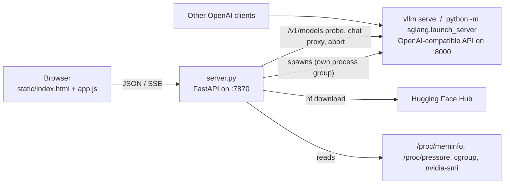

# vLLM Launcher

A self-hosted web UI for running local LLMs with [vLLM](https://github.com/vllm-project/vllm)
or [SGLang](https://github.com/sgl-project/sglang) on your own NVIDIA hardware.

Browse the models on your disk, tune the launch flags with a live command preview, start and
stop the engine, follow its log, download new checkpoints from Hugging Face, and chat with
whatever is loaded — all from one page you can open from a phone on the same network.

It is a single Python file plus three static files. No build step, no database, no accounts.

- [What it does](#what-it-does)
- [How it works](#how-it-works)
- [Install on a fresh machine](#install-on-a-fresh-machine)
- [Using the UI](#using-the-ui)
- [Configuration reference](#configuration-reference)
- [Under the hood](#under-the-hood)
- [HTTP API](#http-api)
- [GPU generation notes](#gpu-generation-notes)
- [Troubleshooting](#troubleshooting)
- [Security](#security)
- [Repository layout](#repository-layout)

---

## What it does

**Two engines, one interface.** Pick vLLM or SGLang per launch. The shared settings (dtype,
quantization, tensor/pipeline parallel, context length, GPU memory fraction, KV-cache dtype,
attention backend, reasoning/tool parsers, …) are the same controls for both; the launcher
emits each engine's own flag names and translates values that only exist in one engine.
Engine-specific knobs (SGLang's scheduler, speculative decoding/MTP, mamba, DP/EP; vLLM's
linear backend, swap space, …) live in their own sections.

**Finds your models and tells the truth about them.** It scans the Hugging Face cache and any
plain model directories, reads `config.json` / `hf_quant_config.json`, and shows size,
quantization scheme, dtype, context length and shard count. Downloads are verified properly:
HF snapshots are symlinks into `blobs/`, so it stats every weight file through the link,
compares shard counts against `model.safetensors.index.json` and looks for `.incomplete`
blobs — a half-finished download is labelled `partial · 1/4 shards` instead of failing ten
minutes into a load.

**Warns before you waste a load.** Checkpoint properties are compared against your GPU's
compute capability (bf16 on pre-Ampere, FP8 KV cache below SM89, FP4 without FP4 tensor
cores, …) and the right flags are pre-filled when you select a model.

**Remembers what worked.** Every launch saves its configuration against that model, separately
per engine, and it is restored when you select the model again. Named presets cover
cross-model setups.

**Keeps the host alive.** Loading a model can freeze the whole machine through *CPU* RAM, not
VRAM — first-start kernel JIT compiles are the usual cause. The launcher refuses to start when
free RAM is already low, sizes JIT parallelism to the RAM budget (including any systemd/Docker
memory cap it runs under), and kills the engine's process group before the box starts to
thrash. See [Host RAM guards](#host-ram-guards).

**Makes kernel JIT work against pip-installed CUDA.** The CUDA toolkit that ships inside the
vLLM/SGLang wheels lacks the unversioned library names the JIT linker expects; the launcher
supplies them without touching the environment. See
[Kernel JIT against pip-installed CUDA](#kernel-jit-against-pip-installed-cuda).

**Shows what is actually happening.** Live log streaming, per-run log files that survive a
reboot, a `compiling kernels 12/18` progress indicator while JIT runs silently, and exit
diagnoses that distinguish a watchdog kill from a kernel OOM from an engine crash.

**Plays nicely with other tools.** If something else is already serving an OpenAI-compatible
API on the usual ports, the launcher adopts it read-only: status, chat and the delete guard see
that model, and Launch refuses to fight it for the GPUs.

**Chat tab.** Streaming, Stop that really aborts generation on the engine, Regenerate, a
collapsible *Thinking* disclosure for reasoning models (works with server-side reasoning
parsers and with raw `<think>` tags), tok/s stats, and the full set of sampling parameters.

---

## How it works



The launcher is a FastAPI process. It discovers engine installations by locating the Python
interpreter of the environment that has each engine, builds an `argv` and a clean environment
for the selected engine, spawns it as a child in its own process group, pumps its output into a
ring buffer (streamed to the browser over SSE and written to a log file), and probes the
engine's `/v1/models` to know when it is ready. A watchdog thread tracks host RAM and kernel JIT
progress while the engine runs. The chat tab talks to the engine through the launcher so the
engine can stay bound to localhost and the API key never reaches the browser.

The model itself is served by the engine on **its own port** (8000 by default). Point your
OpenAI-compatible clients at `http://<host>:8000/v1`, not at the launcher.

---

## Install on a fresh machine

Everything below assumes a Linux machine with an NVIDIA GPU. Commands are shown for
Ubuntu/Debian; adapt the package manager lines for other distributions.

| Requirement | Notes |
|---|---|
| Linux | uses `nvidia-smi`, `ip`, `/proc`, cgroup v2 and POSIX process groups |
| NVIDIA driver | recent enough for the CUDA build your engine wheels target |
| Python 3.10+ | for the launcher; each engine's wheels dictate their own supported versions |
| `fastapi`, `uvicorn`, `httpx`, `pydantic` | already dependencies of both engines |
| C++ compiler + `ninja` | for the engines' first-start kernel JIT |
| vLLM and/or SGLang | either may be absent; the UI shows what was found |

### 1. NVIDIA driver

```bash
sudo ubuntu-drivers install        # or: sudo apt install nvidia-driver-<version>
sudo reboot
nvidia-smi                          # must list your GPU(s)
```

The launcher reads GPUs through `nvidia-smi`, and the engines need the driver's `libcuda.so`.
A system CUDA toolkit is **not** required — the engine wheels bring their own.

### 2. Build tools (for kernel JIT)

vLLM and SGLang compile some kernels on first use through FlashInfer / Triton. That needs a C++
compiler and `ninja`:

```bash
sudo apt install -y build-essential ninja-build git curl
```

### 3. A Python environment manager

Each engine wants its own environment (their pinned `torch` versions frequently differ). Any of
conda, mamba, or plain `venv` works; conda shown:

```bash
curl -fsSL https://repo.anaconda.com/miniconda/Miniconda3-latest-Linux-x86_64.sh -o miniconda.sh
bash miniconda.sh -b -p ~/miniconda3
~/miniconda3/bin/conda init bash
exec bash
```

### 4. Install one or both engines

Name the environments `vllm` and `sglang` — the launcher looks for exactly those names under
the common conda/venv locations and finds them with no configuration at all.

```bash
# vLLM
conda create -n vllm python=3.12 -y
conda activate vllm
pip install vllm
python -c "import vllm; print(vllm.__version__)"
conda deactivate

# SGLang (optional)
conda create -n sglang python=3.12 -y
conda activate sglang
pip install "sglang[all]"
python -c "import sglang; print(sglang.__version__)"
conda deactivate
```

Check the engines' own install pages for the current CUDA/torch matrix if a wheel does not
resolve on your system: [vLLM](https://docs.vllm.ai/en/latest/getting_started/installation/),
[SGLang](https://docs.sglang.ai/start/install.html).

If you use `venv` instead, the launcher also checks `~/vllm/.venv`, `~/vllm-env`, `~/vllm_env`,
`~/.venvs/vllm`, `~/venvs/vllm`, `~/envs/vllm`, `~/.virtualenvs/vllm`, `/opt/vllm` (and the
same for `sglang`). Anything else: set `VLLM_PYTHON` / `SGLANG_PYTHON` (see
[Configuration reference](#configuration-reference)).

### 5. Get the launcher

```bash
git clone https://github.com/Haita735/VLLM-Launcher.git ~/VLLM-Launcher
cd ~/VLLM-Launcher
```

The launcher itself only needs `fastapi`, `uvicorn`, `httpx` and `pydantic`, which both engines
already depend on — so run it with one of the engine interpreters:

```bash
~/miniconda3/envs/vllm/bin/python server.py
```

Prefer a separate environment for the launcher? `python -m venv ~/launcher-env &&
~/launcher-env/bin/pip install fastapi uvicorn httpx pydantic`, then run `server.py` with that
interpreter; the engines are still found in their own environments.

### 6. Open the UI

Go to `http://<machine-ip>:7870` from any device on your LAN (the header lists the URLs the
launcher believes it is reachable on). Check the header:

- **Versions line** — `vLLM x.y.z · SGLang a.b.c · torch … · CUDA … · sm_NN`. A dash means that
  engine was not found; the *Engine* hint under the Server section shows the interpreter in
  use, or which variable to set if the engine is missing.
- **GPU cards** — one per GPU with memory, utilisation and temperature.
- **Host RAM card** — free RAM, swap, and the launcher's memory cap if it runs under one.

If the page does not load, the client is probably outside the allowed networks (private
ranges, loopback, link-local and Tailscale's `100.64.0.0/10` by default). See
`VLLM_LAUNCHER_ALLOWED_CIDRS`. If you have a firewall, open `7870/tcp` (and `8000/tcp` if
other machines will call the model directly).

### 7. Download a model

**Download** tab → paste a Hugging Face URL or `org/name` → *Download*. Progress streams to the
page and the model list refreshes when it finishes. Gated or private repos need a token: put
`HF_TOKEN=hf_…` in the launcher's environment (the `EnvironmentFile` when running as a service).

Models you already have are picked up automatically from `~/.cache/huggingface/hub` and
`~/models` (both HF-cache layout and plain directories with a `config.json` or `*.gguf`).
Change the scan paths with `VLLM_LAUNCHER_MODEL_ROOTS`.

### 8. Launch it

**Launcher** tab → click the model → choose the engine → adjust settings → read the **command
preview** and the notes under it → *Load model*.

The first start of a given model/engine can take a long time: the log shows shard loading, then
the engine JIT-compiles kernels (the status pill reads `loading · compiling kernels n/m`) and
captures CUDA graphs. Later starts reuse the compiled kernels and take a minute or two. When the
pill turns to `serving`, the model is ready.

### 9. Use it

- **Chat** tab for a quick conversation with the loaded model.
- Any OpenAI-compatible client: base URL `http://<machine-ip>:8000/v1`, model name as shown in
  the header pill (the *Served name* field, defaulting to the repo name).

### 10. Run it as a service (recommended)

Two options. **System service** (starts at boot, runs as your user):

```bash
sudo cp vllm-launcher.service /etc/systemd/system/
sudo nano /etc/systemd/system/vllm-launcher.service   # set User/Group, WorkingDirectory, ExecStart
sudo systemctl daemon-reload
sudo systemctl enable --now vllm-launcher
journalctl -u vllm-launcher -f
```

**User service** (no root, uses your own environment):

```bash
mkdir -p ~/.config/systemd/user
sed -e '/^User=/d;/^Group=/d' -e 's/^WantedBy=.*/WantedBy=default.target/' \
    vllm-launcher.service > ~/.config/systemd/user/vllm-launcher.service
nano ~/.config/systemd/user/vllm-launcher.service   # set WorkingDirectory and ExecStart
systemctl --user daemon-reload
systemctl --user enable --now vllm-launcher
loginctl enable-linger "$USER"                       # start at boot without a login
journalctl --user -u vllm-launcher -f
```

Per-machine settings go in the optional `EnvironmentFile` (`/etc/vllm-launcher.env`, or any
path you set in the unit) as `KEY=value` lines — `HF_TOKEN`, `HF_HOME`,
`VLLM_LAUNCHER_MODEL_ROOTS`, thresholds, etc. Nothing toolchain-related belongs there; the
launcher derives `CUDA_HOME`, `LD_LIBRARY_PATH` and `MAX_JOBS` per launch.

**Add a memory cap.** This is the one setting worth doing on a desktop you also use for other
things. It makes the kernel enforce a ceiling on the launcher *and every engine it spawns*,
even if the machine is too thrashed to run the launcher's own watchdog:

```bash
# system service
sudo systemctl set-property vllm-launcher MemoryHigh=13G MemoryMax=16G MemorySwapMax=2G
# user service
systemctl --user set-property vllm-launcher MemoryHigh=13G MemoryMax=16G MemorySwapMax=2G
```

Size it to leave the rest of the machine about half the RAM (the example is for 30 GiB).
Capping at nearly all of RAM does not help — everything outside the cgroup starves. The
launcher reads the cap back and sizes kernel-JIT parallelism to fit inside it.

> **Restarting the launcher unloads the model.** The engine is a child process whose output
> pipe belongs to the launcher. Unload from the UI first, or accept the reload.

### 11. Updating

```bash
cd ~/VLLM-Launcher && git pull
systemctl --user restart vllm-launcher    # or: sudo systemctl restart vllm-launcher
```

Saved profiles and presets live in `profiles/` and `presets/` (gitignored) and are kept.
Run logs and JIT linker shims live under `~/.cache/vllm-launcher/`; deleting that directory is
always safe.

---

## Using the UI

### Launcher tab

**Models** (left). Cards show size, quantization, dtype, context length, shard count, download
state and which engines have a saved config (`⚙ vllm`, `⚙ sglang`). Incomplete downloads are
hidden until you tick *incomplete*. Each card has a *delete* button; anything over 1 GiB asks
you to type `DELETE`, and a loaded model cannot be deleted.

**Launch configuration** (right), grouped into:

| Section | Fields |
|---|---|
| Server | engine, host, port, served name, API key |
| Parallelism & devices | visible GPUs, tensor / pipeline parallel, executor |
| Precision & kernels | dtype, quantization, linear backend, attention backend, mamba backend/cache dtype |
| Memory & KV cache | max model len, GPU memory utilisation, max seqs, max batched tokens, KV-cache dtype, block size, swap space, CPU offload |
| Behaviour | enforce eager, chunked prefill, prefix caching, trust remote code, auto tool choice, reasoning parser, tool-call parser, `limit-mm-per-prompt`, free-form extra args, extra environment |
| SGLang (shown when selected) | load format, schedule policy, max total tokens, DP/EP size, CUDA-graph backends, mamba settings, radix cache, overlap scheduler, deterministic inference, multimodal, DP attention |
| SGLang · Speculative / MTP | algorithm (NEXTN, EAGLE, …), draft model, steps, top-k, draft tokens |

Tri-state selects (`default / on / off`) leave a flag out or add it; for vLLM, *off* emits the
`--no-` form, while SGLang has no `--no-` flags, so *off* is either translated (see
[One config, two engines](#one-config-two-engines)) or omitted.
The **command preview** updates as you type and shows the exact `argv` plus the environment
the launcher will set; the **notes** under it list every value translation, every field the
selected engine has no equivalent for, and the RAM/JIT sizing decisions.

**Save for this model** stores the current form for this model and engine; every launch does
the same automatically. **Reset** drops that engine's saved config (the other engine's is kept)
and returns to suggested defaults. **Presets** save the whole form, model included, under a
name you choose.

**Terminal** (bottom). Live engine output with launcher notes prefixed `launcher:`. The full
buffer is at `/api/logs`; every run is also written to `~/.cache/vllm-launcher/logs/`.

### Download tab

Accepts `org/name`, `https://huggingface.co/org/name`, or a `/tree/...` / `/blob/...` URL; the
parsed repo id is shown as you type. Optional revision and include-glob filters
(`*.safetensors *.json`). Runs `hf download` from whichever environment has `huggingface_hub`
and streams its output. The launcher runs with `HF_HUB_OFFLINE=1` so engines never hit the
network by surprise; the download subprocess is the one place that is switched back on.

### Chat tab

Talks to whatever is serving — a model this launcher started or an adopted external one — on
whichever port it is on, with the engine identified automatically. Parameters: system prompt,
temperature, top-p, top-k, max tokens, presence/frequency/repetition penalties, seed, stop
sequences, streaming toggle, *enable thinking* (sent as `chat_template_kwargs`), *show
reasoning*.

Reasoning models get a *Thinking* disclosure that stays open while the model reasons,
collapses to `Thought for 2.7s` when the answer starts, and re-opens on click. It handles both
server-side reasoning parsers (`reasoning` / `reasoning_content` deltas) and raw inline
`<think>…</think>` tags when no parser is configured. Answers cut off by `max_tokens` are
marked. **Stop** aborts the request on the engine, not just in the page (SGLang needs an
explicit `/abort_request`, which the launcher sends before closing the connection).

---

## Configuration reference

All optional. Set them in the shell, the systemd unit, or its `EnvironmentFile`.

| Variable | Default | Purpose |
|---|---|---|
| `VLLM_LAUNCHER_HOST` | `0.0.0.0` | bind address |
| `VLLM_LAUNCHER_PORT` | `7870` | bind port |
| `VLLM_PYTHON`, `SGLANG_PYTHON` | auto-discovered | interpreter of the environment that has the engine |
| `VLLM_BIN`, `SGLANG_BIN` | auto-discovered | alternative: path to the engine's console script |
| `HF_HOME` | `~/.cache/huggingface` | Hugging Face cache root |
| `HF_TOKEN` | unset | passed through to `hf download` for gated repos |
| `VLLM_LAUNCHER_MODEL_ROOTS` | `$HF_HOME/hub:~/models` | `:`-separated directories to scan |
| `VLLM_LAUNCHER_TEMPLATES` | `./templates` | chat templates resolved by bare name |
| `VLLM_LAUNCHER_PROFILES` | `./profiles` | per-model saved configs |
| `VLLM_LAUNCHER_PRESETS` | `./presets` | named presets |
| `VLLM_LAUNCHER_STATE_DIR` | `~/.cache/vllm-launcher` | run logs (`logs/`) and JIT linker shims (`toolchain/`) |
| `VLLM_LAUNCHER_LOG_FILES_KEPT` | `10` | run log files to keep |
| `VLLM_LAUNCHER_LOG_LINES` | `4000` | in-memory log ring buffer |
| `VLLM_LAUNCHER_STREAM_REPLAY` | `1000` | lines replayed to a newly connected log stream |
| `VLLM_LAUNCHER_EXTERNAL_PORT` | `8000,30000` | ports probed for a server started by something else |
| `VLLM_LAUNCHER_EXTERNAL_API_KEY` | unset | key for that external server, if it needs one |
| `VLLM_LAUNCHER_EXTERNAL_NAME` | generic wording | how messages refer to the other manager |
| `VLLM_LAUNCHER_MIN_FREE_RAM_GIB` | `4` | refuse to launch below this much free host RAM |
| `VLLM_LAUNCHER_RAM_KILL_GIB` | `2` | watchdog kills the engine below this |
| `VLLM_LAUNCHER_RAM_PSI_FULL` | `25` (`80` on unified memory) | … or when memory PSI `full avg10` exceeds this % |
| `VLLM_LAUNCHER_JIT_RAM_PER_JOB_GIB` | `6` | RAM budgeted per parallel `nvcc` job |
| `VLLM_LAUNCHER_ENGINE_RAM_RESERVE_GIB` | `6` | RAM reserved for the engine's own processes before sizing JIT |
| `VLLM_LAUNCHER_JIT_MAX_JOBS` | `4` | hard cap on the derived `MAX_JOBS` |
| `VLLM_LAUNCHER_ALLOWED_CIDRS` | private + loopback + link-local + `100.64.0.0/10` | comma-separated networks that may connect |
| `VLLM_LAUNCHER_ALLOW_ANY` | unset | `1` disables the network allowlist |

Per-launch environment for the *engine* (e.g. `VLLM_USE_V1=1`, `SGLANG_…`) goes in the *Extra
environment* box in the UI and is saved with the profile.

---

## Under the hood

### Engine discovery

Each engine is addressed by the **interpreter of the environment it is installed in**; the
`vllm` / `sglang` console scripts are optional. Resolution order:

1. `VLLM_PYTHON` / `SGLANG_PYTHON` — explicit interpreter.
2. `VLLM_BIN` / `SGLANG_BIN` — explicit console script (its interpreter is read from the shebang).
3. The interpreter running the launcher.
4. A sibling environment named `vllm` / `sglang` next to that interpreter's environment.
5. `envs/<name>` under `~/miniconda3`, `~/anaconda3`, `~/miniforge3`, `~/mambaforge`,
   `~/micromamba`, `/opt/conda`, `/opt/miniconda3`, `/opt/anaconda3`.
6. Common venv paths (`~/<name>/.venv`, `~/<name>-env`, `~/.venvs/<name>`, `/opt/<name>`, …).
7. A `vllm` / `sglang` executable on `PATH`.

A candidate counts only if the engine's package is actually importable from it (a regular
install or a `pip install -e` editable one). Engines that are
not found are shown as unavailable and refused at launch with a message naming the variable to
set — never silently substituted with whatever `python` is on `PATH`. Versions are probed
concurrently at startup inside each engine's own interpreter.

### Per-launch environment and toolchain

The engine's process environment is rebuilt for every launch:

- the engine's `bin/` goes first on `PATH` (its `ninja`, `nvcc` shims, console scripts);
- `CUDA_HOME` and `LD_LIBRARY_PATH` point at the pip-installed CUDA toolkit inside *that*
  engine's environment (`site-packages/nvidia/cu<NN>/`), or `/usr/local/cuda` if there is
  none; inherited values that point into a *different* engine's environment are dropped, so a
  single `EnvironmentFile` can never leak one engine's libraries into the other;
- `CUDA_VISIBLE_DEVICES` follows the GPU picker, `CUDA_DEVICE_ORDER=PCI_BUS_ID`;
- `HF_HOME`, `HF_HUB_OFFLINE=1`, `MAX_JOBS` (see below), `FLASHINFER_NVCC_THREADS=1`;
- `FLASHINFER_DISABLE_VERSION_CHECK=1` only when the engine's `flashinfer-python` and its
  companion `flashinfer-cubin` / `flashinfer-jit-cache` wheels actually disagree;
- the *Extra environment* box last — it always wins.

### Kernel JIT against pip-installed CUDA

The `nvidia-cuda-*` wheels lay the toolkit out as `lib/` with *versioned* sonames only
(`libcudart.so.13`), while FlashInfer and tvm-ffi JIT builds link with
`-L$CUDA_HOME/lib64 -lcudart -lcuda` as if it were a system install. The result is
`ld: cannot find -lcudart` on the first kernel that has to be compiled — after the weights are
already on the GPU — and SGLang then kills its own process tree (exit `-9`, easily mistaken for
an OOM kill).

The launcher fixes this without modifying the environment: it maintains a directory of
`libX.so → libX.so.N` symlinks per engine under `~/.cache/vllm-launcher/toolchain/` and puts it
on `LIBRARY_PATH` (honoured by gcc/clang for every `-l` lookup) and in
`FLASHINFER_EXTRA_LDFLAGS`; `libcuda.so` comes from the driver package. When the toolkit's
`nvcc` and its runtime headers have different versions (normal for independently versioned
wheels), it adds `-DCCCL_DISABLE_CTK_COMPATIBILITY_CHECK` through `FLASHINFER_EXTRA_CUDAFLAGS`
and `NVCC_PREPEND_FLAGS`, so the define also reaches JIT builders that drive `nvcc` themselves
(TileLang, tvm-ffi, torch `cpp_extension`). Both are recorded in the launch notes.

### One config, two engines

Shared fields are mapped onto SGLang's flag names (`--tp-size`, `--context-length`,
`--mem-fraction-static`, `--max-running-requests`, `--chunked-prefill-size`, `--page-size`, …)
and vLLM-only *values* that SGLang's argparse would reject are translated:

| vLLM value | SGLang |
|---|---|
| `attention_backend` `FLASH_ATTN` / `FLASHINFER` / `TRITON_ATTN` / `TORCH_SDPA` / … | `fa3` / `flashinfer` / `triton` / `torch_native` / … |
| `kv_cache_dtype` `fp8` | `fp8_e4m3` (`float16` has no SGLang equivalent → dropped) |
| `tool_call_parser` `qwen3_xml`, `llama3_json`, `deepseek_v3`, `openai` | `qwen3_coder`, `llama3`, `deepseekv3`, `gpt-oss` |
| `reasoning_parser` `deepseek_r1`, `openai_gptoss` | `deepseek-r1`, `gpt-oss` |
| prefix caching **off** | `--disable-radix-cache` |
| chunked prefill **off** | `--chunked-prefill-size -1` |
| enforce eager **on** | `--cuda-graph-backend-{decode,prefill} disabled` |

Fields with no SGLang equivalent (linear backend, swap space, executor backend, …) are dropped
and named in the notes. Bare `--chat-template <name>.jinja` in extra args resolves against
`templates/` for both engines; SGLang's built-in template names and absolute paths pass through.

### Host RAM guards

The failure this prevents: the whole desktop hard-freezes during a model *load*, with nothing
in the journal because the kernel was too thrashed to write it. The weights themselves are not
the problem — safetensors are `mmap`ed and only occupy reclaimable page cache. The cause is
first-start kernel JIT: each `nvcc`/`cicc` job takes ~6 GiB of anonymous memory, and an
unrestricted `MAX_JOBS` runs one per CPU core.

Three layers, all on by default and all tunable:

1. **Pre-launch floor.** Launch is refused (`507`) while `MemAvailable` is below
   `VLLM_LAUNCHER_MIN_FREE_RAM_GIB`.
2. **JIT sizing.** `MAX_JOBS` is computed at launch from the *RAM budget* — the smaller of
   host `MemAvailable` and the launcher's cgroup limit (`memory.high` / `memory.max` from
   systemd or Docker, which the engine inherits) minus the engine reserve — divided by the
   per-job cost, capped, and never *raised* above an inherited value. A warning is added when
   even one job would not fit. Ninja keeps finished objects, so an interrupted compile resumes.
3. **Watchdog.** While the engine runs, a thread samples `/proc/meminfo` and
   `/proc/pressure/memory` twice a second, warns when swap fills, and SIGKILLs the engine's
   process group when free RAM drops below `VLLM_LAUNCHER_RAM_KILL_GIB` or the system has been
   stalled on memory for three consecutive samples. The reason is written to the log and to
   stderr/journald.

The header's RAM card turns red when a launch would be refused, and the launch notes name the
largest other RAM users on the box. Exit `-9` is diagnosed: watchdog kill, a kernel OOM kill
inside the cgroup (counted from `memory.events`), Stop, or — for SGLang — the engine killing its
own tree after a worker exception, in which case the real error is above in the log.

### JIT progress

FlashInfer / sgl-kernel / tvm-ffi run `ninja` with the output captured, and the engine's own
progress bar blocks on the result, so a first start can look hung for many minutes. The
launcher watches the engine's process group for a `ninja -C <dir>` and reports the build from
ninja's own bookkeeping (targets in `build.ninja` vs. entries finished by this run in
`.ninja_log`): `kernel JIT started: <op> - 18 compile steps, 1 at a time` in the log, a
`compiling kernels 12/18` suffix on the status pill, and an estimate of the time left.

### Adopting an external server

When nothing of its own is running, the launcher probes `VLLM_LAUNCHER_EXTERNAL_PORT`
(default `8000,30000`). If an OpenAI-compatible server answers, it is adopted read-only: the
status pill shows `serving · external`, the engine is identified (`/version` → vLLM,
`/get_model_info` → SGLang), chat and the delete guard use that model, Launch refuses with
`409` instead of competing for the GPUs, and Stop is disabled because the process is not the
launcher's child.

### Logs

Engine output goes to an in-memory ring buffer streamed over SSE (the last
`VLLM_LAUNCHER_STREAM_REPLAY` lines are replayed to a new connection so a reload does not stall
the page) and to `~/.cache/vllm-launcher/logs/<engine>-<timestamp>.log`. Launcher-originated
lines (`launcher: …`) also go to stderr so journald keeps them even if the host goes down.
Sequence numbers are monotonic across runs, so a browser that stays open sees every run.

---

## HTTP API

Everything the UI does is a plain JSON endpoint.

| Method | Path | Notes |
|---|---|---|
| `GET` | `/api/system` | engine availability & versions, GPUs, RAM + guard thresholds, model roots, access URLs |
| `GET` | `/api/gpus` | live GPU memory / utilisation / temperature and host RAM (polled) |
| `GET` | `/api/models` | `?refresh=true` rescans; `?include_missing=true` includes incomplete |
| `POST` | `/api/models/delete` | `{"models": ["org/name"]}`; refuses loaded models and paths outside the roots |
| `POST` | `/api/preview` | launch spec → `argv`, environment overrides and notes, without running |
| `POST` | `/api/launch` | start the engine (`409` port busy / already running, `507` low RAM); saves the profile |
| `POST` | `/api/stop` | SIGTERM the process group, SIGKILL after 30 s, wait for workers to exit |
| `GET` | `/api/status` | process state, engine, port, `/v1/models` probe, JIT progress, run log path |
| `GET` | `/api/logs`, `/api/logs/stream` | ring buffer / SSE |
| `GET` `PUT` `DELETE` | `/api/profiles` | per-model, per-engine saved configs (`?model=…&engine=…` to delete one slot) |
| `GET` | `/api/presets`; `PUT` `DELETE` `/api/presets/{id}` | named presets |
| `POST` | `/api/download`, `/api/download/cancel`, `/api/download/resolve` | `{"repo", "revision", "include"}` |
| `GET` | `/api/download/status`, `/api/download/logs`, `/api/download/logs/stream` | |
| `POST` | `/api/chat` | OpenAI-shaped messages + sampling params; streams SSE or returns JSON |

A launch spec is the JSON the UI collects: `model`, `engine`, the fields listed under
[Launcher tab](#launcher-tab) in snake_case, `gpu_indices`, `extra_args`, `env`. Saved profiles
in `profiles/` show the exact shape.

---

## GPU generation notes

Modern quantized checkpoints mostly assume Ada or Blackwell; many still run on older cards
through different kernels. The launcher's checkpoint notes cover these automatically:

- **bf16 checkpoints on pre-Ampere (< sm_80)**: set `dtype=float16`; pre-filled.
- **NVFP4 without FP4 tensor cores (< sm_100)**: vLLM runs weight-only W4A16 through Marlin
  (`linear-backend=marlin`, pre-filled for vLLM); check SGLang's kernel support for the card.
- **FP8 KV cache below sm_89**: `kv-cache-dtype=auto` resolves to fp8 when the checkpoint ships
  fp8 KV scales and then aborts; set it explicitly (vLLM `float16`, SGLang `bf16`).
- **FlashAttention 2 needs sm_80+**; attention falls back to Triton, which is fine.
- **Hybrid linear-attention / Gated DeltaNet models** JIT their Triton kernels for whatever
  architecture is present; expect a longer first start.
- **Unified memory (GB10: DGX Spark, ASUS GX10, sm_121)**: there is no VRAM - the GPU shares the
  host's LPDDR5X and `nvidia-smi` reports every memory field as `[N/A]`. The launcher detects
  this (the GPU card says *unified memory*, `/api/system` has `unified_memory: true`) and
  reads the model's footprint from the Host RAM card instead. Because the weights *are* host
  memory, faulting them in stalls the box 25-30 % of the time while it is perfectly healthy, so
  the watchdog's PSI trip point defaults to 80 % there instead of 25 %; the `MemAvailable`
  floor (`VLLM_LAUNCHER_RAM_KILL_GIB`) is unchanged and remains the real OOM backstop. Set
  `VLLM_LAUNCHER_RAM_PSI_FULL` to override either default (`101` disables the PSI trip).
  Discrete-GPU machines are unaffected.

For reference, on 2× sm_75 cards a 35B-A3B NVFP4 MoE loaded in ~9.5 min the first time (JIT),
~4.5 min afterwards, and generated at 40–100 tok/s.

---

## Troubleshooting

**The machine froze while a model was loading**
Host RAM, not VRAM — see [Host RAM guards](#host-ram-guards). Check the run log in
`~/.cache/vllm-launcher/logs/` (it survives the reboot) for a `RAM WATCHDOG` line. If the box
went down before the watchdog could act, add a memory cap to the service (step 10). First
starts JIT-compile kernels; later starts reuse them.

**Loading looks stuck after the shards reach 100 %**
Kernel JIT. The status pill shows `compiling kernels n/m` and the log gets progress lines; a
fresh FlashInfer op can take 15–20 minutes at `MAX_JOBS=1`. It only happens once per
model/engine/GPU combination.

**SGLang dies with exit `-9` right after "Capture … CUDA graph begin"**
Not a memory kill: SGLang SIGKILLs its own process tree after a worker exception, and the
launcher's exit line says so. Scroll up for the real error — most often `RuntimeError: Ninja
build failed` with `ld: cannot find -lcudart`, which the launcher's toolchain shims fix (see
[Kernel JIT against pip-installed CUDA](#kernel-jit-against-pip-installed-cuda)). If it still
appears, `CUDA_HOME` was overridden to a toolkit without a `lib64/`.

**SGLang exits with code 2 immediately (`invalid choice`)**
A value SGLang's argparse does not know, usually from *Extra engine args* or a hand-edited
profile. The launcher translates the common vLLM spellings and lists what it changed under the
command preview; anything else must use SGLang's vocabulary.

**`<engine> is not installed on this machine`**
Discovery found no environment with that package. Set `VLLM_PYTHON` / `SGLANG_PYTHON` to the
interpreter of the environment that has it and restart the launcher. The *Engine* hint in the
Server section shows what was found.

**`flashinfer-cubin version (x) does not match flashinfer version (y)`**
The engine pinned `flashinfer-python` to a release whose companion wheel differs. The launcher
sets `FLASHINFER_DISABLE_VERSION_CHECK=1` automatically when the installed versions disagree;
if you see the error anyway, set the variable in the *Extra environment* box.

**`TypeError: GGUFConfig.override_quantization_method() got an unexpected keyword argument`**
An out-of-date `vllm-gguf-plugin`; vLLM iterates every registered quantization method, so this
breaks all loads, not just GGUF. `pip install -U vllm-gguf-plugin`.

**Model loads then sits at "No available shared memory broadcast block found in 60 seconds"**
Normal: it is compiling Triton kernels and capturing CUDA graphs. `--enforce-eager` skips this
at some throughput cost.

**A model shows `partial` or `not downloaded`**
Weights are missing, dangling or half-fetched. Re-run the download; the card names the shard
count.

**Chat answers are cut off / empty with `finish_reason: "length"`**
Reasoning models spend the budget thinking before answering. Raise *Max tokens* or turn off
*enable thinking*.

**The page shows a `403`**
Your client's address is outside `VLLM_LAUNCHER_ALLOWED_CIDRS`. Add your network, or set
`VLLM_LAUNCHER_ALLOW_ANY=1` if the launcher is only reachable through a VPN/firewall you trust.

---

## Security

This is a LAN tool with **no authentication**. It starts processes, writes files and deletes
model directories on behalf of anyone who can reach port 7870.

What it does defend against:

- Requests from outside the CIDR allowlist get `403`.
- Launch arguments are assembled as an `argv` list and passed to `subprocess` without a shell;
  extra args go through `shlex.split` and must start with a flag.
- `model` must be an entry discovery found; arbitrary paths are rejected.
- Deletes resolve the target and require it to sit strictly inside a configured model root.
- Environment variable names are regex-validated; engine names are validated.
- API keys stay server-side; the chat proxy attaches them.

What it does **not** do: authenticate anyone. Treat access to the launcher as shell access to
the GPU box and never expose it to the internet. `profiles/` and `presets/` are gitignored
because they can contain API keys.

---

## Repository layout

```
server.py               FastAPI backend: discovery, launch, RAM guards, JIT tracking, downloads, chat proxy, SSE
static/index.html       markup for the three tabs
static/app.js           client logic, no dependencies
static/styles.css       dark theme
templates/              chat templates referenced by bare name from extra args
tools/logging_proxy.py  transparent request/response logger for debugging OpenAI clients
vllm-launcher.service   systemd unit template
profiles/               per-model saved configs   (gitignored, created on first save)
presets/                named presets             (gitignored)
```

Runtime state outside the repo: `~/.cache/vllm-launcher/logs/` (run logs) and
`~/.cache/vllm-launcher/toolchain/` (JIT linker shims), both safe to delete.

## License

MIT
